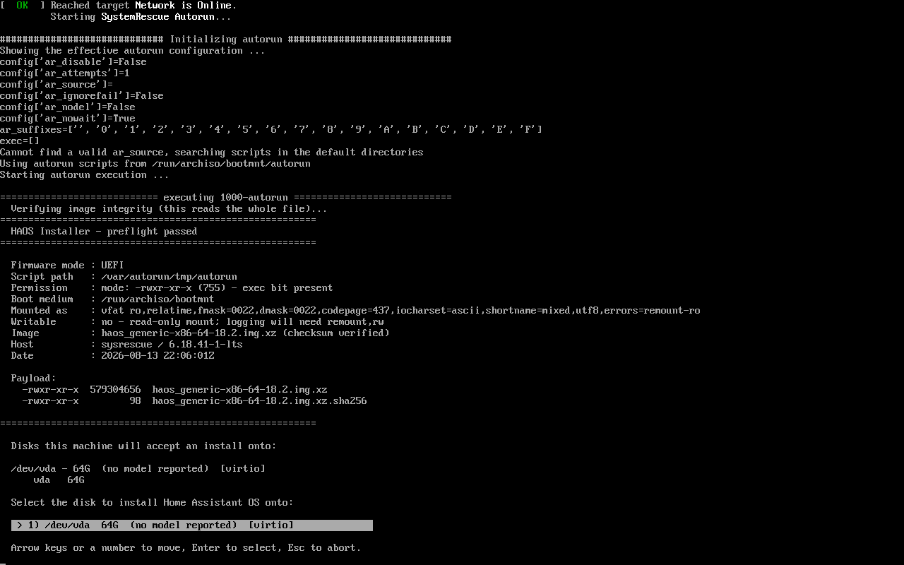
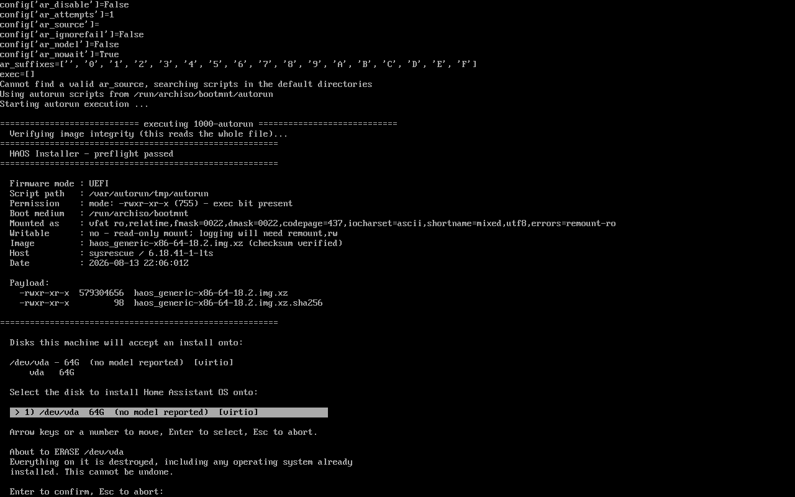

# sysrescue-haos-installer

Turn a USB stick into an installer that writes **Home Assistant OS** onto a
PC's internal disk — by copying three files onto a stock
[SystemRescue](https://www.system-rescue.org/) stick.

No ISO to rebuild. No build toolchain. No Windows application. Write
SystemRescue to a stick with its official writer, drop in three files, boot the
target machine, choose a disk, press Enter twice.

> Not affiliated with or endorsed by the Home Assistant project. "Home
> Assistant" is a trademark of the Open Home Foundation.

---

## Why this exists

Home Assistant OS ships no installer. The documented method is to boot a live
Ubuntu, download the image, and restore it onto the internal disk with GNOME
Disks — a lot of manual steps to get wrong on a machine you are about to erase.

Two community projects automate it already. Both build an image:
[`hass-os-installer-iso`](https://github.com/JosephM101/hass-os-installer-iso)
needs `live-build` and Vagrant; [`HAOS-USB-Creator`](https://github.com/Xalies/HAOS-USB-Creator)
ships a Windows application that produces the stick for you.

This one customises a stock live system in place. The entire build step is
"copy four files onto a mounted stick", which means a new Home Assistant
release is a one-line version bump and a re-copy — not an image rebuild.

## What it does

1. Boots SystemRescue and runs automatically — no menu to find, nothing to type.
2. **Refuses to proceed** unless the machine booted UEFI, the boot medium is
   present, exactly one OS image is on the stick, and that image's checksum
   matches.
3. Lists the internal disks it is willing to write to, with size, model,
   transport, and what is already on each one.
4. Writes the image, streamed and decompressed on the fly, then **reads the
   disk back and compares it byte for byte** against the source.
5. Re-reads the partition table, shows the result, and explains what to do next.
6. Writes a log of the whole run **back onto the stick**, so a failure can be
   diagnosed after the machine is powered off.

Removable media, USB devices and the stick it booted from are never offered as
targets.

## Requirements

- A target machine that boots **UEFI** with **Secure Boot disabled** — Home
  Assistant OS requires it, and the installer refuses rather than producing a
  machine that cannot boot what it just wrote.
- A USB stick of 4 GB or more.
- A Linux or Windows machine to build the stick.

## Building the stick

```bash
git clone https://github.com/YOUR-USER/sysrescue-haos-installer
cd sysrescue-haos-installer

# 1. Fetch and verify SystemRescue + the Home Assistant OS image
./build/fetch-artifacts.sh
./tests/run.sh                    # proves the artifacts are intact

# 2. Write SystemRescue to the stick — NOT with dd
./tmp/sysrescueusbwriter-x86_64.AppImage -t /dev/sdX tmp/systemrescue-*.iso

# 3. Replug the stick, then drop the installer onto it
./build/make-stick.sh /media/$USER/RESCUE1302
```

**Step 2 must not use `dd`.** Copying the ISO byte-for-byte produces a
read-only medium, and the whole design depends on being able to put files on
the stick afterwards. Use the official
[SystemRescue USB writer](https://www.system-rescue.org/Installing-SystemRescue-on-a-USB-memory-stick/)
on Linux, or Rufus in **ISO mode** on Windows.

The stick's volume label must stay `RESCUE####`, matching the SystemRescue
version. `make-stick.sh` warns if the path looks wrong.

## Using it

Boot the target machine from the stick. Everything below happens by itself.

### Preflight

Four checks run before anything is offered. Each refusal names what to do
about it — an operator stuck in a live environment has no browser to search
with.

```
  Verifying image integrity (this reads the whole file)...
========================================================
  HAOS Installer — preflight passed
========================================================

  Firmware mode : UEFI
  Boot medium   : /run/archiso/bootmnt
  Mounted as    : vfat ro,relatime,...
  Image         : haos_generic-x86-64-18.2.img.xz (checksum verified)
```

A machine booted in legacy BIOS mode is turned away before anything is
touched:

```
[FATAL] this machine booted in legacy BIOS/CSM mode.
     Home Assistant OS requires UEFI. Installing now would write an image this
     machine cannot boot, and the failure would only appear after the disk had
     already been erased.
     Reboot into firmware setup, enable UEFI boot, disable Secure Boot, then
     boot from this stick again.
```

### Choosing a disk



Each disk is listed once with its existing partitions and labels — a model
number alone is rarely enough to tell two disks apart, but "500G, NTFS,
labelled Windows" usually is. The highlighted row repeats the size, model and
bus, so what you are about to erase is readable without looking back up the
screen.

Nothing is auto-selected, even when there is only one candidate.

### Confirming



Enter confirms, Esc aborts, and any other key is ignored rather than treated
as an answer.

### Writing

The image is streamed to the disk and then read back and compared over its
exact uncompressed length. A write that reports success but produces an
unbootable disk is the failure this is designed to catch.

```
468+1 records in
468+1 records out
1962954752 bytes (2.0 GB, 1.8 GiB) copied, 9.57149 s, 205 MB/s

  Write complete.

  Verifying 1962954752 bytes against the image...
  Verification passed — /dev/vda matches the image exactly.
```

### Afterwards

The resulting partition table is shown, the run is logged to the stick, and
the machine is left running unless you ask otherwise.

## Updating the Home Assistant version

Edit one line in `build/artifacts.conf`, then re-run:

```bash
./build/fetch-artifacts.sh
./build/make-stick.sh /media/$USER/RESCUE1302
```

No image to rebuild.

## Tests

```bash
./tests/run.sh
```

Around 190 assertions, no dependencies beyond `bash`, `shellcheck` and the
coreutils already present. They cover the guards, disk filtering, the menu,
the write and verification, logging, and the whole run end to end with only
the destructive steps replaced.

`tests/integration.md` documents the parts a unit test cannot reach: running
the real installer in a virtual machine, and booting the disk it produced.

## Repository layout

```
src/autorun          the installer — SystemRescue runs this by name
src/500-haos.yaml    boot configuration drop-in
build/               artifact manifest, fetcher, stick builder
tests/               test suites and captured device fixtures
docs/                design notes, prior art, evidence
tasks/               plan and task history
```

## Known limitations

- UEFI only. Legacy BIOS targets are refused, not supported.
- One Home Assistant OS image per stick, by design — the installer will not
  guess which version you meant.
- The stick must be built on Linux or Windows; there is no macOS path.

## Licence

MIT — see [LICENSE](LICENSE).
