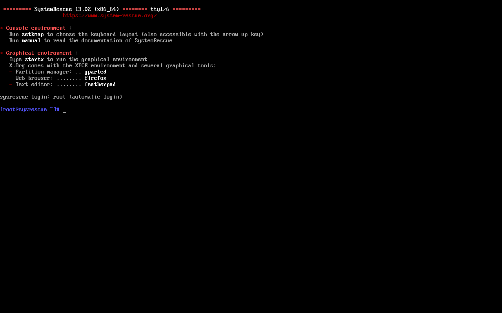
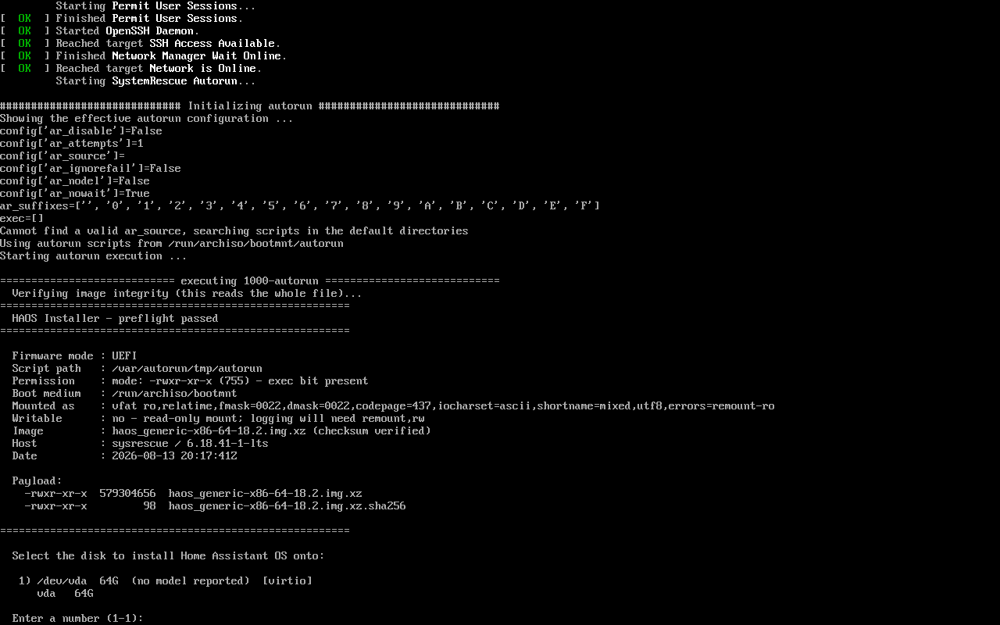
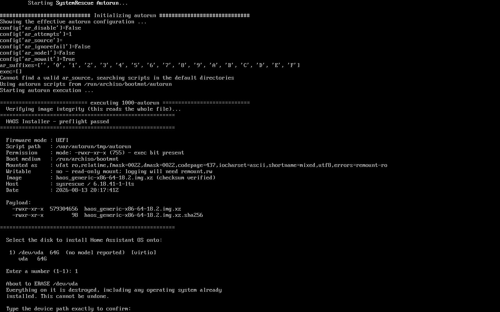

# Evidence

> **The two Task 7 images below show an older interface.** They were captured
> when the disk was chosen by typing a number and confirmed by typing the
> device path. Selection is now arrow-driven and both steps are a single
> keypress. The images are kept because what they document — that the run
> reached those stages on a real machine — is unchanged, but do not read them
> as a picture of the current tool. The README shows the current interface.

Screenshots and logs captured when a checkpoint passed. Kept because "the test
suite is green" and "it worked on the machine" are different claims, and only
the second one matters for an installer that erases disks.

## Task 2 — the boot harness works



SystemRescue 13.02 reaching an autologin root shell in 45 seconds under OVMF.
Proves the harness assembles a bootable command line; it cannot show which
firmware mode the guest actually used, because both modes render an identical
console. That distinction needed a command running *inside* the guest, which
is why the assertion moved to Task 3.

## Task 7 — the full install, driven in a guest



The interesting lines are near the bottom:

- `Using autorun scripts from /run/archiso/bootmnt/autorun` — the drop-in
  mechanism the whole design rests on.
- `Verifying image integrity (this reads the whole file)...` then
  `checksum verified` — the preflight guard doing real work.
- `Firmware mode : UEFI` — reported from inside the guest, which is what
  closed the assertion Task 2 could not make.
- `Mounted as : vfat ro,relatime` and `Writable : no` — the read-only boot
  medium that made logging need a remount.
- `1) /dev/vda 64G (no model reported) [virtio]` — one candidate. The USB
  stick the installer booted from is correctly absent from its own menu.



`About to ERASE /dev/vda` followed by `Type the device path exactly to
confirm:`. A yes/no prompt gets answered by reflex; a path has to be read
first.

The run's own log is at `tmp/task7-vm-install.log` (untracked — `tmp/` is
scratch). Its conclusion:

```
468+1 records in
468+1 records out
1962954752 bytes (2.0 GB, 1.8 GiB) copied, 9.57149 s, 205 MB/s

  Write complete.

  Verifying 1962954752 bytes against the image...
  Verification passed — /dev/vda matches the image exactly.
```

`468+1 records` is the detail worth keeping. Before `iflag=fullblock` the same
write produced 210,021 partial records, because a pipe hands `dd` whatever the
decompressor emitted and `dd` writes that short block immediately. The output
was still byte-correct, but `oflag=direct` requires aligned transfers — so the
unaligned path is exactly what makes direct I/O fail on real hardware. No
"Direct I/O was refused" line appears above, which means it didn't.
